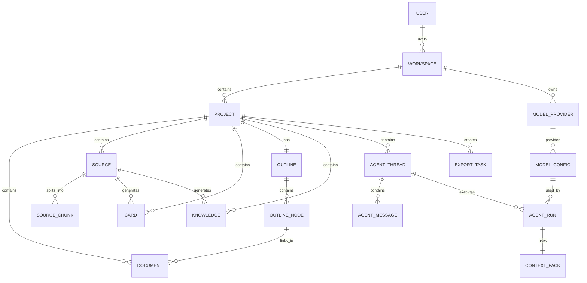

# ERD 关系说明 v0.1

## 1. 设计原则

```text
Project 是核心聚合根
题材模式不拆独立底层表
AI 输出必须可追溯
ContextPack 必须是快照
N:N 关系显式建表
```

---

## 2. 核心 ERD



---

## 3. MVP 关系表

```text
document_sources
document_cards
document_knowledge
outline_node_sources
outline_node_cards
card_knowledge
context_pack_documents
context_pack_sources
context_pack_source_chunks
context_pack_cards
context_pack_knowledge
context_pack_messages
```

---

## 4. MVP 强制关系

```text
Project 1:N Document
Project 1:N Source
Project 1:N Card
Project 1:1 Outline
Outline 1:N OutlineNode
Project 1:N Knowledge
Project 1:N AgentThread
AgentThread 1:N AgentMessage
AgentRun 1:1 ContextPack
ModelProvider 1:N ModelConfig
Project 1:N ExportTask
```
